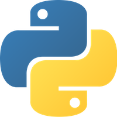

# Curso básico de Python

En este curso aprenderas a programar en Python

**Requisitos**
- Python 3.6 o superior
- Computadora con Windows, Linux o macOS
- Editor de texto como [Visual Studio Code](https://code.visualstudio.com/)
-----------

